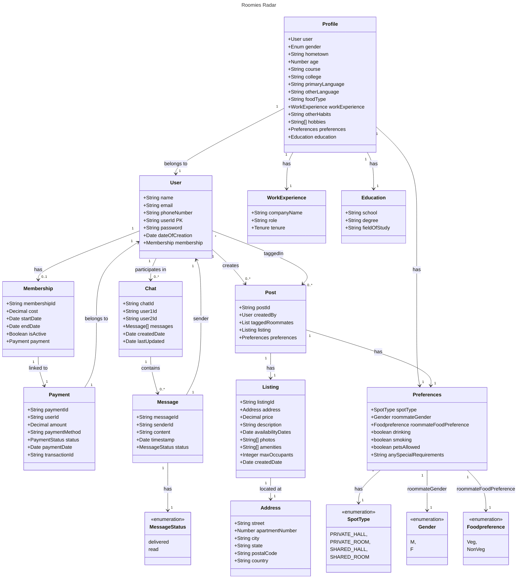

## API Aces

# Roomies Radar

Welcome to **Roomies Radar** by the **API Aces** team! Roomies Radar is a comprehensive application designed to help users find compatible roommates based on their preferences and create property listings for shared accommodations.

## Table of Contents
- [Roomies Radar](#roomies-radar)
  - [Table of Contents](#table-of-contents)
  - [Overview](#overview)
  - [Domain Model](#domain-model)
    - [Main Entities:](#main-entities)
    - [Relationships:](#relationships)
- [Collaborated with](#collaborated-with)
- [Design Model](#design-model)
- [Commands to commit and push:](#commands-to-commit-and-push)
- [Pre-requisites](#pre-requisites)
  - [API Documentation](#api-documentation)
  - [Features](#features)
  - [Technologies Used](#technologies-used)
  - [Running Test Users](#running-test-users)
- [🤝 Contributions](#-contributions)
  - [🔮 Features for next release](#-features-for-next-release)

## Overview
Roomies Radar provides a streamlined solution for finding the perfect roommate and listing shared accommodations. It leverages a robust domain model and an OpenAPI-defined RESTful API to handle user registration, login, profile management, and property listings.

- Roomies Radar is a web platform designed to simplify the process of finding and booking accommodation for international students.
- The website connects current students who have available accommodations with new or international students looking for a place to stay.
- Roomie Finder offers a streamlined, user-friendly interface where students can browse, list, and book accommodations based on their preferences and budget.

## Domain Model

The Roomies Radar project is designed using Domain-Driven Design (DDD) principles. Below are the main entities and relationships:

### Main Entities:
1. **User**: Represents the user of the application with details like name, email, phone number, and membership status.
2. **Profile**: Stores additional user information such as gender, age, education, preferences, and work experience.
3. **Preferences**: Defines roommate preferences, including gender, room type, and special requirements.
4. **WorkExperience**: Captures the user’s work history.
5. **Education**: Holds educational background details of the user.
6. **Post**: Represents a user-created post for finding roommates or listing properties.
7. **Listing**: Stores details of the property listing, including address, price, amenities, and availability.
8. **Address**: Defines the location details of a property.


### Relationships:
- A **Profile** belongs to a **User** and includes **WorkExperience**, **Preferences**, and **Education**.
- A **User** can create multiple **Posts** and be tagged in multiple posts.
- A **Post** has a **Listing**, and a **Listing** is located at an **Address**.


# Collaborated with
    ~ B Sai Kalyan                            ---         burra.sa@northeastern.edu
    ~ Chinnasurya Prasad Vulavala             ---         vulavala.c@northeastern.edu
    ~ Sai Lalith Pulluri                      ---          pulluri.sa@northeastern.edu
    ~ Tianrui Li                              ---          li.tianr@northeastern.edu


# Design Model




# Commands to commit and push:

- git init (Even there is an hidden files I have initializes just for best practice)

- git add .

- git add filename.extension (used to add separate files in the commit list)

- git commit -m "READEME"

- git push origin main


# Pre-requisites

- Just one windows or Linux or Mac OS system and little bit of knowledge about git commands.
- Use VsCode to create and write the code in html and css. This is the best IDE for most of the programming languages.
- Use extensions which are related to HTML, CSS, live server and more to finish your work faster.
- Install mermaidjs and swagger viewer extensions on your IDE


## API Documentation

The API documentation is available [here](./service/docs/bruno/openapi/) or can be explored directly using Swagger UI by visiting `/api-docs` on the running application.


## Features

- User Registration and Authentication
- Profile Management (including Preferences, Work Experience, Education)
- Roommate Matching based on Preferences
- Property Listings and Address Management
- In-app messaging between users


## Technologies Used

- **Backend**: Node.js, Express
- **Frontend**: ReactJS, TypeScript (TSX)
- **State Management**: Redux
- **Internationalization (i18n)**: For multi-language support in the UI
- **Database**: MongoDB
- **Version Control**: Git
- **API Documentation**: OpenAPI 3.0, Swagger UI
- **Mermaid.js**: For diagram visualization
- **API Integration**: Fugu API for communication and messaging functionality


## Running Test Users


User 1:
        email: testuser@gmail.com
        password: testuser@123
User 2:
        email: testuser2@gmail.com
        password: testuser2@1234


# 🤝 Contributions

Want to learn with our code by editing:

It's pretty straingforward :


```git clone <repository url>```


Install Dependencies:
    
    
    For Both Front-end & Backend:
    
        npm install

        
Run the Application:
    
    For Front-end:
    
        cd app
        npm run dev
    
    
    For Back-end:
    
        cd service
        npm run dev

        


## 🔮 Features for next release

* Implement an admin permission system to manage user access levels and control over certain platform features.
  
* 3D Frontend Design


